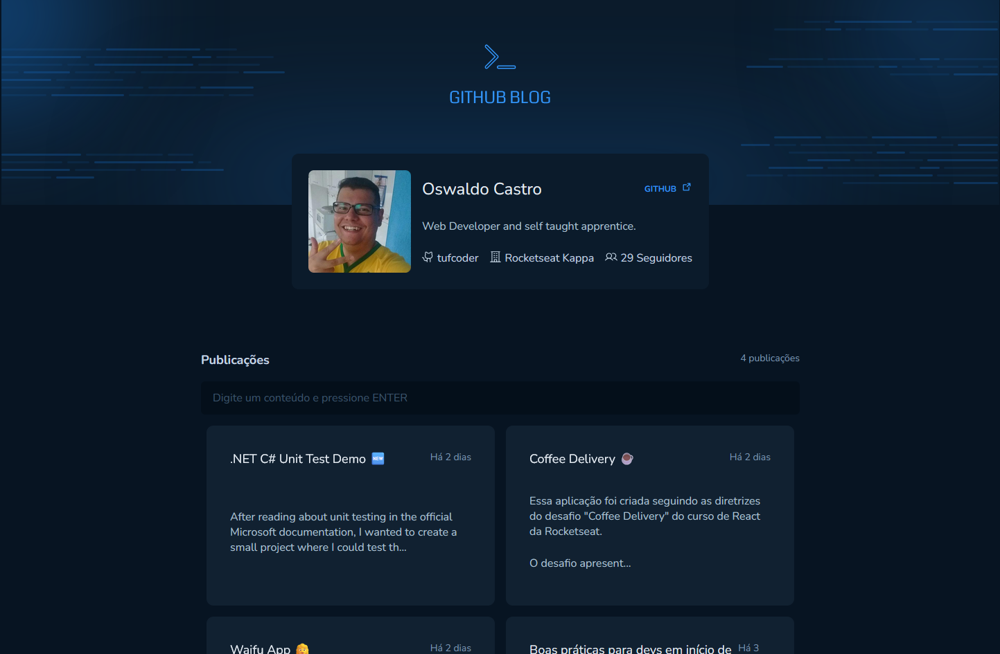
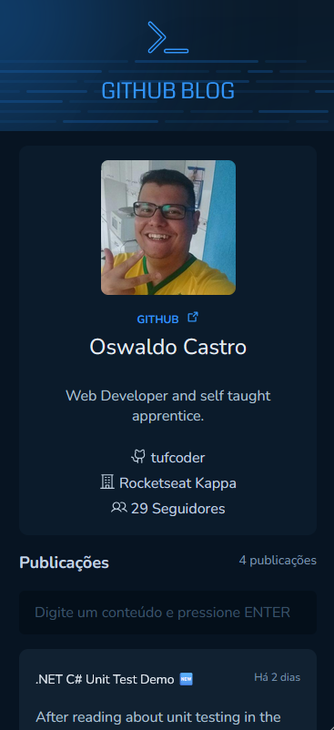
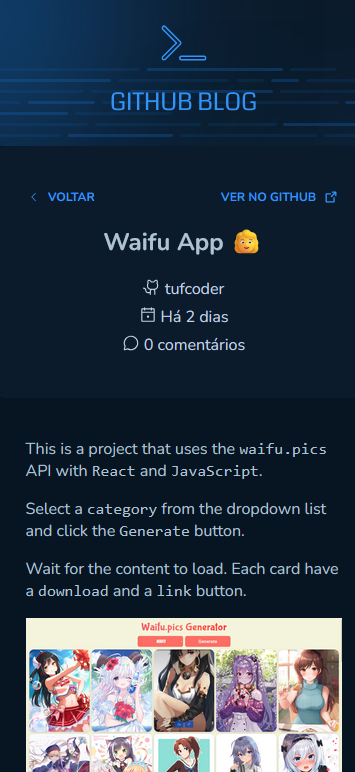

# Ignite Github Blog

[](https://app.netlify.com/sites/tufcoder-github-blog/deploys)

> ⚠️
> Se o projeto estiver em branco, deve ser o PAT do github que expirou tá 😝.

[](https://tufcoder-github-blog.netlify.app/)

## Sobre o desafio

Nesse desafio, você vai desenvolver uma aplicação que utilizará da API do GitHub para buscar issues de um repositório, dados do seu perfil e exibir elas como um blog.

- Listagem do seu perfil com imagem, número de seguidores, nome e outras informações disponíveis pela API do GitHub
- Listar e filtrar todas as issues do repositório com um pequeno resumo do conteúdo dela
- Criar uma página para exibir um post (issue) completo

<table>
    <tr>
        <td>
            
        </td>
        <td>
            
        </td>
    </tr>
</table>

Apesar de serem poucas funcionalidades, você vai precisar relembrar conceitos como:

- Fetch / Axios
- Roteamento e React Router DOM
- Formulários

Para completar esse desafio você vai precisar fazer alguns preparativos e principalmente de algumas pesquisas para entender sobre a API do GitHub.

## Preparativos

Além disso, você vai precisar de alguns preparativos para completar esse desafio.

Primeiramente, crie um repositório **público** no GitHub. Esse repositório será onde você vai criar `issues` que serão os posts do seu blog que, inclusive, podem ser do mesmo repositório onde você vai deixar o seu código.

O título da `issue` será o nome do Post e o conteúdo será o corpo do post.

Depois disso, você irá precisar utilizar algumas API’s do GitHub:

- [GitHub Users API](https://docs.github.com/pt/rest/users/users?apiVersion=2022-11-28#get-a-user): Será utilizada para buscar os dados do seu usuário do GitHub. No link você pode ver como fazer a requisição para ela, mas basicamente você deve fazer uma chamada para `api.github.com/users/${username}`.
- [GitHub Search API](https://docs.github.com/pt/rest/search/search?apiVersion=2022-11-28#search-issues-and-pull-requests): Essa é a parte mais divertida da aplicação! Você vai utilizar a API de busca do GitHub para filtrar por issues do repositório que você criou. Além disso, essa será a mesma API que você utilizará para fazer o filtro por busca.

A rota a ser utilizada principalmente é a rota `https://api.github.com/search/issues`.
Essa rota recebe um parâmetro `q` que faz uma busca a partir de uma string. Nessa string, você pode passar, por exemplo, qual repositório você quer buscar enviando o texto `q=${texto}%20repo:${username}/${repo}`. Além disso, o parâmetro `q` também será usado para enviar um texto de busca, ou seja, você enviara o texto de busca + o parâmetro `repo` para ele buscar tudo junto.

- [GitHub Issues API](https://docs.github.com/pt/rest/issues/issues#get-an-issue): Para exibir o post completo, você precisará utilizar a `GitHub Issues API` para retornar todos os dados de uma issue. Você pode fazer isso através do `number` da issue para acessá-la através da URL no mesmo repositório, onde no mesmo exemplo de issue anterior, a URL ficaria assim: `https://api.github.com/repos/rocketseat-education/reactjs-github-blog-challenge/issues/1`.

> ⚠️
> Atenção: A API do GitHub possui um limite de 10 requisições por minuto caso você > não configure uma chave privada. Você pode ter gratuitamente até 30 requisições > por minuto configurando uma chave privada, você pode ver pela documentação: > https://docs.github.com/pt/rest/search#rate-limit

## Libs 📚

```sh
npm install styled-components
npm install @phosphor-icons/react
npm install react-router
npm install date-fns
npm install axios
npm install react-hook-form
npm install zod
npm install @hookform/resolvers
npm install react-markdown
npm install remark-gfm

# Dev Dependencies
npm install prettier eslint-plugin-prettier eslint-config-prettier --save-dev
```

## Techs

- Vite ⚡
- React ⚛️
- Typescript/JavaScript 🩵💚